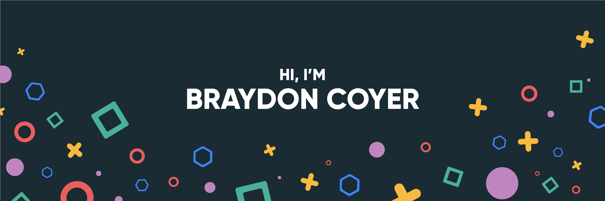

Hey there 👋

I’m Anké, a thrid year full-stack devfeloper currntly studying at Open Window.

Want to know more about me? [Check out my portfolio on GitHub.](https://github.com/AnkeatOpenWindow) and on [Behance](https://www.behance.net/ankeduraan2).

 

## 📌 Pinned Repositories

 

 

 

 

 

## &#x1f4c8; GitHub Stats

 

 
 

## 💼 Skills

More Skills

 

 
